# Elite Steel Concepts (ESC) — Complete Internal Linking Architecture & Strategy

**Document Version:** 1.0  
**Scope:** Internal Linking Architecture, Anchor Text Taxonomy, Topic Siloing, and Post-by-Post Mapping for Elite Steel Concepts (`esteelconcepts.com`).

---

## Table of Contents

1. [Executive Summary & Strategic Objectives](#1-executive-summary--strategic-objectives)
2. [Site Information Architecture & Target Page Hierarchy](#2-site-information-architecture--target-page-hierarchy)
3. [Internal Linking Rules & Anchor Text Protocol](#3-internal-linking-rules--anchor-text-protocol)
4. [The 7 Thematic Content Silos](#4-the-7-thematic-content-silos)
5. [Master Post-by-Post Internal Linking Matrix](#5-master-post-by-post-internal-linking-matrix)
6. [Dedicated Homepage (`/`) Linking Protocol](#6-dedicated-homepage--linking-protocol)
7. [Bidirectional (Reverse) Linking & Pillar Support](#7-bidirectional-reverse-linking--pillar-support)
8. [Sitewide & Template Architectural Fixes](#8-sitewide--template-architectural-fixes)
9. [Step-by-Step Implementation Roadmap](#9-step-by-step-implementation-roadmap)

---

## 1. Executive Summary & Strategic Objectives

The primary objective of this internal linking structure is to **funnel organic search impressions and PageRank equity** from high-ranking, informational blog posts into high-converting commercial pages:

1. **Pass Contextual PageRank to Money Pages:** Transfer search authority to the Homepage (`/`), core service pages (`/services/*`), and conversion engines (`/quote`, `/contact`).
2. **Establish Semantic Topical Clusters (Silos):** Group related content (e.g., Fire Suppression $\leftrightarrow$ Propane $\leftrightarrow$ Hoods $\leftrightarrow$ DMV Compliance Hub) so search engine crawlers recognize ESC's deep industry authority.
3. **Enhance User Journey & Reduce Bounce Rates:** Move readers from top-of-funnel discovery (e.g., researching generator sizing or equipment costs) to mid-funnel proof (portfolio, compliance, process) and bottom-of-funnel conversion (custom quote builder).
4. **Anchor Text Optimization:** Eliminate dead-weight anchors (e.g., "click here", "read more") and replace them with natural, keyword-targeted exact and partial matches.

```mermaid
graph TD
    subgraph TopOfFunnel ["Top-of-Funnel: High-Impression Blog Posts"]
        B1["Cost & Buying Guides"]
        B2["Compliance & Codes (Fire, Gas, NSF)"]
        B3["Design & Layout Engineering"]
        B4["Trailers vs Trucks & Kei Conversions"]
        B5["Repairs, Maintenance & Upgrades"]
        B6["Regional Launch Guides (VA, MD, DC)"]
    end

    subgraph MidOfFunnel ["Middle-of-Funnel: Service Silos & Authority Hubs"]
        S1["/services/custom-food-trucks"]
        S2["/services/custom-food-trailers"]
        S3["/services/repairs-and-upgrades"]
        S4["/services/design-and-consultation"]
        S5["/services/fleet-expansion"]
        A1["/compliance (DMV Health/Fire Hub)"]
        A2["/process (Build Journey)"]
        A3["/portfolio (Showcase & Case Studies)"]
        A4["/locations (DMV & Regional Pages)"]
    end

    subgraph BottomOfFunnel ["Bottom-of-Funnel: High-Conversion Money Pages"]
        H["Homepage (/)<br>Root Brand Authority"]
        Q["/quote<br>Custom Pricing Calculator"]
        C["/contact<br>Direct Consultations & Calls"]
    end

    B1 -->|Primary Target| Q
    B1 -->|Brand Anchor| H
    B1 -->|Service Silo| S1

    B2 -->|Regulatory Authority| A1
    B2 -->|Engineering| S4
    B2 -->|Service Upgrade| S3

    B3 -->|Design Authority| S4
    B3 -->|Fabrication Process| A2
    B3 -->|Primary Build| S1

    B4 -->|Trailer Silo| S2
    B4 -->|Truck Silo| S1
    B4 -->|Proof| A3

    B5 -->|Repair Silo| S3
    B5 -->|Direct Inquiries| C
    B5 -->|Brand Anchor| H

    B6 -->|Geo Targets| A4
    B6 -->|Brand Anchor| H
    B6 -->|Estimate| Q

    S1 --> H
    S1 --> Q
    S2 --> H
    S2 --> Q
    S3 --> C
    A1 --> Q
    A4 --> Q
```



---

## 2. Site Information Architecture & Target Page Hierarchy

Every internal link must point to an intentional destination within this 4-tier hierarchy:

### Tier 1: Core Conversion & Commercial Hubs (Money Pages)
- **Homepage (`/`)**: Main entity authority, brand anchor target, primary keywords: `custom food truck builder`, `commercial mobile kitchen fabricator`.
- **Request a Quote (`/quote`)**: Primary bottom-of-funnel conversion target for high-intent visitors.
- **Contact Us (`/contact`)**: Secondary direct inquiry / phone consultation / shop tour booking.

### Tier 2: Service Pillar Pages (Solution Silos)
- **Custom Food Trucks (`/services/custom-food-trucks`)**: Motorized builds, step-van conversions (Freightliner MT45/MT55, Ford F-59), turn-key mobile kitchens.
- **Custom Food Trailers (`/services/custom-food-trailers`)**: Concession trailers, porch trailers, BBQ smoker trailers, mobile pizza trailers.
- **Repairs & Upgrades (`/services/repairs-and-upgrades`)**: Commercial exhaust hood installation, fire suppression certification, electrical/plumbing retrofits, generator installs.
- **Design & Consultation (`/services/design-and-consultation`)**: CAD layouts, workflow optimization, equipment spec review, health department pre-audits.
- **Fleet Expansion (`/services/fleet-expansion`)**: Multi-unit production, franchise expansion, corporate marketing vehicles.
- **Services Index (`/services`)**: Comprehensive overview of fabrication capabilities.

### Tier 3: Proof, Authority & Regulatory Hubs
- **DMV Compliance Hub (`/compliance`)**: Health codes, fire marshals, NSF standards, DC/MD/VA regulations.
- **Build Process (`/process`)**: 6-stage engineering roadmap from CAD design to keys handover.
- **Portfolio Showcase (`/portfolio`)**: Completed builds and project case studies (`/portfolio/ironclad-smoker`, `/portfolio/dough-and-fire`, `/portfolio/copper-espresso`, `/portfolio/volt-burgers`, `/portfolio/neon-noodle`, `/portfolio/baja-coastal`).
- **About Us (`/about`)**: Company history, Manassas facility, 12+ years of experience, 350+ trucks built.
- **Testimonials (`/testimonials`)**: Verified client reviews and operator success stories.

### Tier 4: Regional & Geo Target Pages
- **Locations Hub (`/locations`)**: Service area overview covering the DMV and 48 states.
- **City Landing Pages (`/locations/[city]`)**:
  - *Washington DC:* `/locations/washington-dc`
  - *Northern Virginia:* `/locations/arlington-va`, `/locations/alexandria-va`, `/locations/fairfax-va`, `/locations/manassas-va`, `/locations/richmond-va`, `/locations/ashburn-va`, `/locations/woodbridge-va`, `/locations/tysons-va`, `/locations/reston-va`
  - *Maryland:* `/locations/baltimore-md`, `/locations/rockville-md`, `/locations/bethesda-md`, `/locations/silver-spring-md`, `/locations/annapolis-md`, `/locations/frederick-md`
  - *North Carolina:* `/locations/charlotte-nc`, `/locations/raleigh-nc`, `/locations/durham-nc`

---

## 3. Internal Linking Rules & Anchor Text Protocol

### A. Link Distribution per Article
For a standard 1,200–2,500 word blog post, maintain **3 to 5 in-content links**:
1. **Link 1 (Early Contextual - Top 25%):** Primary Service Subpage or Compliance Hub (Exact / Partial keyword).
2. **Link 2 (Mid-Article Proof/Process - 50%):** Build Process (`/process`), Portfolio Case Study (`/portfolio`), or Homepage (`/`).
3. **Link 3 (Bottom/CTA - 75%-100%):** Direct conversion link to `/quote` or `/contact`.
4. **Link 4 (Topical Sister Post):** Lateral link to a related post in the same thematic cluster.

### B. Anchor Text Distribution Ratios
To avoid algorithmic penalties for over-optimization while maintaining strong topical signals, adhere to this anchor distribution:

| Anchor Type | Target Ratio | Examples |
| :--- | :--- | :--- |
| **Exact / Partial Keyword Match** | **40%** | `custom food truck builder`, `commercial food trailer manufacturing`, `DMV food truck compliance regulations` |
| **Semantic / Natural Phrase** | **30%** | `our custom mobile kitchen fabrication process`, `commercial exhaust hood installation services`, `food truck layout and workflow design` |
| **Brand / Compound Anchor** | **20%** | `Elite Steel Concepts`, `ESC custom food trucks`, `Elite Steel Concepts in Manassas, VA` |
| **Action / Transactional CTA** | **10%** | `request a custom build quote`, `calculate your food truck build cost`, `schedule a design consultation` |

### C. Critical Linking Guidelines
- 🚫 **Never use generic anchor text** (`click here`, `read more`, `this post`, `link`).
- 🚫 **Never link to the same target URL multiple times in the same post** using identical anchor text.
- ✅ **Ensure link text flows grammatically** within the sentence rather than looking forced or bolted-on.
- ✅ **Open internal links in the same tab** (`target="_self"`) to maintain standard navigation flow.

---

## 4. The 7 Thematic Content Silos

```
Silo 1: Cost, Buying & Financing
├── Target Commercial Pages: /quote, /services/custom-food-trucks, /
└── Core Topics: Build costs, new vs used, financing methods, depreciation, remodeling budgets

Silo 2: Health Codes, Fire Safety & Regulatory Compliance
├── Target Commercial Pages: /compliance, /services/repairs-and-upgrades, /locations/washington-dc
└── Core Topics: Fire suppression systems, NSF standards, propane safety, commissary requirements, VDH/DC Health codes

Silo 3: Kitchen Design, Layout & Equipment Installation
├── Target Commercial Pages: /services/design-and-consultation, /process, /portfolio
└── Core Topics: Commercial hood installation, flooring, prep tables, pizza ovens, serving windows, workflow CAD

Silo 4: Custom Food Trailers & Specialty Conversions
├── Target Commercial Pages: /services/custom-food-trailers, /services/custom-food-trucks, /portfolio
└── Core Topics: Food truck vs trailer, concession pricing, Kei truck conversions, step van builds

Silo 5: Repairs, Maintenance & Mechanical Upgrades
├── Target Commercial Pages: /services/repairs-and-upgrades, /contact, /
└── Core Topics: Plumbing systems, electrical load calculation, generator installation, regular maintenance

Silo 6: Business Operations, Menus & Fleet Scaling
├── Target Commercial Pages: /services/fleet-expansion, /testimonials, /quote
└── Core Topics: Multi-unit fleet expansion, high-profit menu concepts, booking festivals, business planning

Silo 7: DMV & Regional Market Guides
├── Target Commercial Pages: /locations, /locations/[city], /about
└── Core Topics: Starting a food truck in Virginia, Maryland requirements, DC vending permits
```

---

## 5. Master Post-by-Post Internal Linking Matrix

### Silo 1: Cost, Buying & Financing

| Source Blog Post Slug | Target URL | Recommended Anchor Text | Trigger / Context Sentence |
| :--- | :--- | :--- | :--- |
| `what-does-it-actually-cost-to-buy-a-food-truck-new-a-builders-honest-breakdown` | `/quote` | `get an itemized custom food truck quote` | *"To understand exact line-item equipment and chassis pricing, you can [get an itemized custom food truck quote](/quote) based on your target menu."* |
| | `/services/custom-food-trucks` | `custom food truck fabrication` | *"Investing in professional [custom food truck fabrication](/services/custom-food-trucks) ensures commercial-grade durability from day one."* |
| | `/` | `Elite Steel Concepts` | *"At [Elite Steel Concepts](/), we provide completely transparent pricing on all builds with zero hidden fees."* |
| `food-truck-financing-in-2026-every-way-to-fund-your-build` | `/quote` | `custom build cost estimate` | *"Before approaching commercial lenders or equipment financiers, request a [custom build cost estimate](/quote) with full spec sheets."* |
| | `/process` | `step-by-step build process` | *"Reviewing our [step-by-step build process](/process) helps lenders understand the milestone-based release of funds."* |
| | `/blog/concession-trailer-cost-2026-what-a-custom-build-actually-costs-builders-price-breakdown` | `concession trailer cost breakdown` | *"If you're weighing lower entry costs, review our complete [concession trailer cost breakdown](/blog/concession-trailer-cost-2026-what-a-custom-build-actually-costs-builders-price-breakdown)."* |
| `buying-a-used-food-truck-in-2026-what-to-inspect-what-to-avoid-and-what-will-cost-you-builders-checklist` | `/services/repairs-and-upgrades` | `commercial food truck retrofits and repairs` | *"If a used rig fails mechanical or code checks, budget for [commercial food truck retrofits and repairs](/services/repairs-and-upgrades) before opening."* |
| | `/compliance` | `DMV health and fire code standards` | *"Make sure the plumbing and electrical systems comply with current [DMV health and fire code standards](/compliance)."* |
| | `/` | `custom food truck manufacturer` | *"Working with an experienced [custom food truck manufacturer](/) guarantees your vehicle meets all state regulations."* |
| `food-truck-remodel-cost-2026-what-a-full-interior-renovation-actually-costs-builders-breakdown` | `/services/repairs-and-upgrades` | `food truck renovation and equipment upgrades` | *"Full kitchen rebuilds require specialized [food truck renovation and equipment upgrades](/services/repairs-and-upgrades)."* |
| | `/quote` | `request a renovation quote` | *"Contact our fabrication shop to [request a renovation quote](/quote) tailored to your existing chassis."* |
| `what-nobody-tells-you-about-buying-a-food-truck-new-in-2026` | `/services/custom-food-trucks` | `new custom food truck builds` | *"When evaluating [new custom food truck builds](/services/custom-food-trucks), warranty support and health code guarantees are paramount."* |
| | `/quote` | `pricing consultation` | *"Schedule a free [pricing consultation](/quote) to review equipment specs."* |

---

### Silo 2: Health Codes, Fire Safety & Regulatory Compliance

| Source Blog Post Slug | Target URL | Recommended Anchor Text | Trigger / Context Sentence |
| :--- | :--- | :--- | :--- |
| `food-truck-fire-suppression-system-what-every-owner-must-know-before-inspection` | `/compliance` | `DMV fire safety and suppression compliance` | *"Fire marshals inspect manual pull stations and automatic gas shutoff valves in accordance with [DMV fire safety and suppression compliance](/compliance)."* |
| | `/services/repairs-and-upgrades` | `fire suppression system installation and certification` | *"Our technicians handle certified [fire suppression system installation and certification](/services/repairs-and-upgrades)."* |
| | `/` | `Elite Steel Concepts` | *"Every truck engineered by [Elite Steel Concepts](/) is pre-inspected to pass NFPA 96 standards."* |
| `propane-installation-requirements-for-food-trucks-a-complete-safety--compliance-guide` | `/compliance` | `commercial mobile kitchen compliance guidelines` | *"Review our full [commercial mobile kitchen compliance guidelines](/compliance) for gas piping and leak detection."* |
| | `/services/design-and-consultation` | `custom gas line layout and engineering` | *"Ensure safety by integrating [custom gas line layout and engineering](/services/design-and-consultation) during the design phase."* |
| | `/blog/food-truck-fire-suppression-system-what-every-owner-must-know-before-inspection` | `fire suppression system requirements` | *"Propane lines must tie directly into your [fire suppression system requirements](/blog/food-truck-fire-suppression-system-what-every-owner-must-know-before-inspection) to cut gas flow when triggered."* |
| `nsf-certification-for-food-trucks-2026-what-it-means-what-requires-it-and-why-your-inspector-will-check-every-item` | `/compliance` | `food truck health department regulations` | *"Health inspectors look for NSF blue marks across all surfaces. Check our [food truck health department regulations](/compliance) breakdown."* |
| | `/services/custom-food-trucks` | `NSF-compliant custom food trucks` | *"We fabricate [NSF-compliant custom food trucks](/services/custom-food-trucks) using 304 food-grade stainless steel."* |
| `commissary-kitchen-for-food-trucks-2026-what-it-is-why-every-state-requires-it-and-how-to-find-one` | `/compliance` | `DMV commissary kitchen requirements` | *"Most jurisdictions in DC, MD, and VA require a signed commissary agreement. See our [DMV commissary kitchen requirements](/compliance)."* |
| | `/locations/washington-dc` | `Washington DC food truck regulations` | *"Operating in the District requires strict compliance with [Washington DC food truck regulations](/locations/washington-dc)."* |
| `what-health-code-compliant-actually-means-when-youre-building-a-custom-food-truck` | `/compliance` | `100% health code compliance standards` | *"Read our complete guide to [100% health code compliance standards](/compliance) across the Mid-Atlantic."* |
| | `/about` | `master craftsmanship standards` | *"Discover how our [master craftsmanship standards](/about) ensure first-pass inspection success."* |

---

### Silo 3: Kitchen Design, Layout & Equipment Installation

| Source Blog Post Slug | Target URL | Recommended Anchor Text | Trigger / Context Sentence |
| :--- | :--- | :--- | :--- |
| `-how-to-design-a-food-truck-kitchen-that-maximizes-speed-and-efficiency` | `/services/design-and-consultation` | `commercial food truck design and consultation` | *"Optimize your line with our [commercial food truck design and consultation](/services/design-and-consultation) services."* |
| | `/process` | `our end-to-end fabrication process` | *"See how CAD floorplans translate to physical builds in [our end-to-end fabrication process](/process)."* |
| | `/` | `custom food truck builders` | *"Experienced [custom food truck builders](/) prevent costly layout bottlenecks before welding begins."* |
| `-food-truck-ventilation-requirements-everything-you-need-to-know-before-you-build` | `/services/repairs-and-upgrades` | `commercial exhaust hood installation` | *"For custom hood sizing and makeup air fans, explore our [commercial exhaust hood installation](/services/repairs-and-upgrades) capabilities."* |
| | `/compliance` | `food truck ventilation and fire codes` | *"Exhaust hoods must satisfy strict [food truck ventilation and fire codes](/compliance) to operate legally."* |
| `the-ultimate-food-truck-equipment-buying-guide-for-new-owners` | `/services/custom-food-trucks` | `custom food truck builder` | *"Partnering with a dedicated [custom food truck builder](/services/custom-food-trucks) ensures every commercial appliance fits flush."* |
| | `/quote` | `configure your equipment and get a quote` | *"Ready to price out your flat top, fryers, and refrigeration? [Configure your equipment and get a quote](/quote)."* |
| | `/portfolio` | `view our completed mobile kitchen builds` | *"To see real-world equipment configurations, [view our completed mobile kitchen builds](/portfolio)."* |
| `pizza-oven-installation-guide-for-food-trucks-everything-you-need-to-know` | `/services/custom-food-trailers` | `custom mobile pizza trailers` | *"High-heat pizza ovens require heavy chassis reinforcement—explore our [custom mobile pizza trailers](/services/custom-food-trailers)."* |
| | `/portfolio/dough-and-fire` | `Dough & Fire pizza trailer showcase` | *"Inspect our custom brick-oven build in the [Dough & Fire pizza trailer showcase](/portfolio/dough-and-fire)."* |
| `best-flooring-options-for-food-trucks-durable-safe--easy-to-maintain-solutions` | `/services/repairs-and-upgrades` | `commercial food truck flooring upgrades` | *"Upgrade worn floors with seamless aluminum diamond plate through our [commercial food truck flooring upgrades](/services/repairs-and-upgrades)."* |
| | `/compliance` | `health department sanitation codes` | *"Flooring must feature sealed coving to satisfy [health department sanitation codes](/compliance)."* |
| `sandwich-prep-table-installation-for-food-trucks-a-complete-guide-for-safe--efficient-mobile-kitchens` | `/services/design-and-consultation` | `commercial kitchen layout design` | *"Place prep tables in your ergonomic cold zone with our [commercial kitchen layout design](/services/design-and-consultation)."* |
| `food-truck-welding-why-quality-matters-for-long-lasting-mobile-kitchens` | `/about` | `precision TIG and MIG welding craftsmanship` | *"Learn more about our [precision TIG and MIG welding craftsmanship](/about) at our Manassas fabrication facility."* |
| | `/` | `Elite Steel Concepts` | *"At [Elite Steel Concepts](/), structural integrity is engineered to endure road vibration for decades."* |

---

### Silo 4: Custom Food Trailers & Specialty Conversions

| Source Blog Post Slug | Target URL | Recommended Anchor Text | Trigger / Context Sentence |
| :--- | :--- | :--- | :--- |
| `food-truck-vs-food-trailer-which-is-the-right-choice-for-your-business` | `/services/custom-food-trailers` | `custom concession food trailers` | *"If lower startup costs and flexible towing appeal to you, browse our [custom concession food trailers](/services/custom-food-trailers)."* |
| | `/services/custom-food-trucks` | `custom motorized food trucks` | *"For fast parking and urban maneuverability, explore our [custom motorized food trucks](/services/custom-food-trucks)."* |
| | `/quote` | `request a custom build comparison quote` | *"Compare pricing directly: [request a custom build comparison quote](/quote) for both vehicle formats."* |
| `concession-trailer-cost-2026-what-a-custom-build-actually-costs-builders-price-breakdown` | `/services/custom-food-trailers` | `custom food trailer manufacturing` | *"Learn more about our heavy-duty chassis engineering on our [custom food trailer manufacturing](/services/custom-food-trailers) page."* |
| | `/portfolio/ironclad-smoker` | `Ironclad Smoker custom BBQ trailer` | *"See how we integrated commercial smokers in our [Ironclad Smoker custom BBQ trailer](/portfolio/ironclad-smoker)."* |
| `kei-truck-food-truck-conversion-2026-the-complete-builders-guide` | `/services/custom-food-trucks` | `compact food truck conversions` | *"We engineer specialized [compact food truck conversions](/services/custom-food-trucks) for coffee, boba, and street-food concepts."* |
| | `/portfolio/copper-espresso` | `The Copper Espresso custom build` | *"Check out our compact mobile cafe case study: [The Copper Espresso custom build](/portfolio/copper-espresso)."* |
| | `/quote` | `start your custom mini truck build` | *"Ready to discuss dimensions and power? [Start your custom mini truck build](/quote) consultation."* |
| `step-van-food-truck-conversion-2026-complete-builders-guide-what-you-need-to-know` | `/services/custom-food-trucks` | `step-van commercial kitchen conversions` | *"Our shop specializes in heavy-duty [step-van commercial kitchen conversions](/services/custom-food-trucks) built on Ford and Freightliner chassis."* |
| | `/process` | `full vehicle fabrication process` | *"Discover each build stage in our [full vehicle fabrication process](/process)."* |

---

### Silo 5: Repairs, Maintenance & Commercial Upgrades

| Source Blog Post Slug | Target URL | Recommended Anchor Text | Trigger / Context Sentence |
| :--- | :--- | :--- | :--- |
| `food-truck-repair-near-me-complete-guide-to-commercial-kitchen-equipment-repairs` | `/services/repairs-and-upgrades` | `commercial food truck repair services` | *"When equipment goes down, schedule prompt [commercial food truck repair services](/services/repairs-and-upgrades) to minimize downtime."* |
| | `/contact` | `contact our Manassas repair shop` | *"For emergency equipment diagnoses, [contact our Manassas repair shop](/contact) directly."* |
| | `/` | `Elite Steel Concepts` | *"Trusted by over 350 operators, [Elite Steel Concepts](/) keeps mobile kitchens operational."* |
| `the-ultimate-guide-to-food-truck-repairs--commercial-kitchen-equipment-maintenance-2026` | `/services/repairs-and-upgrades` | `mobile kitchen maintenance and upgrades` | *"Routine [mobile kitchen maintenance and upgrades](/services/repairs-and-upgrades) prevent catastrophic failures during peak events."* |
| | `/compliance` | `annual health inspection compliance` | *"Regular maintenance ensures you breeze through your [annual health inspection compliance](/compliance) audits."* |
| `food-truck-generator-installation-everything-you-need-to-know` | `/services/repairs-and-upgrades` | `generator installation and power system maintenance` | *"Explore our [generator installation and power system maintenance](/services/repairs-and-upgrades) for quiet, high-capacity commercial power."* |
| | `/services/design-and-consultation` | `electrical load balancing and design` | *"Prevent blown breakers by calculating [electrical load balancing and design](/services/design-and-consultation) before purchase."* |
| `food-truck-plumbing-2026-fresh-water-grey-water-three-compartment-sinks--everything-your-inspector-checks` | `/compliance` | `mobile food plumbing regulations` | *"Inspectors check tank ratios and anti-siphon valves according to [mobile food plumbing regulations](/compliance)."* |
| | `/services/repairs-and-upgrades` | `commercial plumbing repair and winterization` | *"Protect your lines from freezing with [commercial plumbing repair and winterization](/services/repairs-and-upgrades)."* |

---

### Silo 6: Business Operations, Menus & Fleet Scaling

| Source Blog Post Slug | Target URL | Recommended Anchor Text | Trigger / Context Sentence |
| :--- | :--- | :--- | :--- |
| `food-truck-fleet-expansion-2026-how-to-go-from-1-truck-to-3-without-destroying-your-cash-flow-or-quality` | `/services/fleet-expansion` | `food truck fleet expansion services` | *"Scale your brand with standardized [food truck fleet expansion services](/services/fleet-expansion) designed for multi-unit operators."* |
| | `/testimonials` | `client success stories` | *"Read how other multi-unit operators grew their business in our [client success stories](/testimonials)."* |
| | `/quote` | `request fleet volume pricing` | *"Contact our commercial team to [request fleet volume pricing](/quote)."* |
| `35-food-truck-ideas-that-are-actually-profitable-in-2026-builders-honest-breakdown` | `/services/custom-food-trucks` | `custom food truck builder` | *"Whichever concept you choose, work with a [custom food truck builder](/services/custom-food-trucks) to tailor equipment to your menu."* |
| | `/portfolio` | `our custom build portfolio` | *"Get inspired by seeing these concepts in action across [our custom build portfolio](/portfolio)."* |
| | `/quote` | `get a free build quote` | *"Ready to bring your concept to life? [Get a free build quote](/quote) today."* |
| `food-truck-business-plan-complete-step-by-step-guide` | `/services/design-and-consultation` | `mobile kitchen feasibility and layout consultation` | *"Strengthen your business plan with our [mobile kitchen feasibility and layout consultation](/services/design-and-consultation)."* |
| | `/` | `Elite Steel Concepts` | *"Builders like [Elite Steel Concepts](/) provide the technical specifications required by commercial lenders."* |

---

### Silo 7: DMV & Regional Market Guides

| Source Blog Post Slug | Target URL | Recommended Anchor Text | Trigger / Context Sentence |
| :--- | :--- | :--- | :--- |
| `how-to-start-a-food-truck-business-in-virginia-in-2026-the-complete-step-by-step-guide` | `/locations/arlington-va` | `Virginia food truck builder` | *"Based in Manassas, we are your local [Virginia food truck builder](/locations/arlington-va) serving Northern Virginia and Richmond."* |
| | `/compliance` | `Virginia health department mobile food guidelines` | *"Ensure compliance with VDH regulations by reviewing our [Virginia health department mobile food guidelines](/compliance)."* |
| | `/quote` | `request a Virginia build consultation` | *"Visit our Manassas shop or [request a Virginia build consultation](/quote) online."* |
| `custom-food-truck-builder-in-maryland-2026-what-maryland-entrepreneurs-need-to-know-before-starting` | `/locations/baltimore-md` | `Maryland custom food truck builders` | *"We design and deliver turnkey mobile kitchens for [Maryland custom food truck builders](/locations/baltimore-md) across Baltimore and Montgomery County."* |
| | `/compliance` | `Maryland mobile food compliance codes` | *"Maryland requires strict grease trap and fire standards; review our [Maryland mobile food compliance codes](/compliance)."* |
| `custom-food-truck-builders-in-virginia-how-to-choose-the-right-one-in-2026` | `/` | `Elite Steel Concepts in Manassas, VA` | *"Tour our fabrication facility at [Elite Steel Concepts in Manassas, VA](/) to inspect active builds."* |
| | `/about` | `12+ years of custom fabrication experience` | *"Choose a team with [12+ years of custom fabrication experience](/about) and 350+ completed builds."* |

---

## 6. Dedicated Homepage (`/`) Linking Protocol

To build maximum topical authority for the root domain without tripping over-optimization filters, follow this anchor text variance rotation:

| Target Page | Keyword Goal | Rotation Anchor Texts |
| :--- | :--- | :--- |
| **`/` (Homepage)** | Primary Brand Authority | • `Elite Steel Concepts`<br>• `Elite Steel Concepts in Manassas, VA`<br>• `esteelconcepts.com` |
| | High-Intent Core Build Terms | • `custom food truck builder`<br>• `professional food truck manufacturing`<br>• `custom food truck builders`<br>• `commercial mobile kitchen fabricator` |
| | Regional Leadership | • `custom food truck builders in Virginia`<br>• `DMV mobile kitchen manufacturer` |

---

## 7. Bidirectional (Reverse) Linking & Pillar Support

Internal linking must never be a one-way street. Commercial and pillar pages must link contextually down into relevant blog guides:

### A. From Service Pages to Authority Blogs
- **`/services/custom-food-trucks`:**
  - *"Unsure how commercial kitchen builds come together? Read our guide on [How Custom Food Trucks Are Built Step by Step](/blog/how-custom-food-trucks-are-built-step-by-step-a-complete-guide-to-custom-food-truck-fabrication)."*
  - *"Selecting cooking appliances? Review [The Ultimate Food Truck Equipment Buying Guide](/blog/the-ultimate-food-truck-equipment-buying-guide-for-new-owners)."*
- **`/services/custom-food-trailers`:**
  - *"Weighing vehicle formats? Read our comparison of [Food Truck vs Food Trailer](/blog/food-truck-vs-food-trailer-which-is-the-right-choice-for-your-business)."*
  - *"Wondering about trailer pricing? Check our [Concession Trailer Cost Breakdown](/blog/concession-trailer-cost-2026-what-a-custom-build-actually-costs-builders-price-breakdown)."*
- **`/services/repairs-and-upgrades`:**
  - *"Preparing for annual fire audits? Review [Food Truck Fire Suppression System Requirements](/blog/food-truck-fire-suppression-system-what-every-owner-must-know-before-inspection)."*
  - *"Need equipment troubleshooting? See [Common Food Truck Repairs Every Owner Should Know](/blog/common-food-truck-repairs-every-owner-should-know)."*

### B. From Compliance Hub to Regulatory Guides
- **`/compliance`:**
  - Link directly to:
    - [NSF Certification Guide](/blog/nsf-certification-for-food-trucks-2026-what-it-means-what-requires-it-and-why-your-inspector-will-check-every-item)
    - [Propane Installation & Safety Guide](/blog/propane-installation-requirements-for-food-trucks-a-complete-safety--compliance-guide)
    - [Commissary Kitchen Requirements](/blog/commissary-kitchen-for-food-trucks-2026-what-it-is-why-every-state-requires-it-and-how-to-find-one)
    - [Food Truck Plumbing & Water Systems](/blog/food-truck-plumbing-2026-fresh-water-grey-water-three-compartment-sinks--everything-your-inspector-checks)

---

## 8. Sitewide & Template Architectural Fixes

### A. Footer Navigation Links Update
In `components/Footer.tsx`, ensure the Services list links directly to dedicated sub-pages instead of the generic `/services` index:

```tsx
// components/Footer.tsx
const serviceLinks = [
  { name: "Custom Food Trucks", href: "/services/custom-food-trucks" },
  { name: "Custom Food Trailers", href: "/services/custom-food-trailers" },
  { name: "Repairs & Upgrades", href: "/services/repairs-and-upgrades" },
  { name: "Design & Consultation", href: "/services/design-and-consultation" },
  { name: "Fleet Expansion", href: "/services/fleet-expansion" },
];
```

### B. Dynamic Related Intel Siloing
In `app/(public)/blog/[slug]/page.tsx`, update the `relatedPosts` selector to prioritize posts within the **same category / cluster tag** rather than fetching random posts:

```tsx
// app/(public)/blog/[slug]/page.tsx
const relatedPosts = allPosts
  .filter(p => p.id !== post.id && p.status === "Published" && p.category === post.category)
  .slice(0, 3);
```

---

## 9. Step-by-Step Implementation Roadmap

1. **Sprint 1 (Immediate - Top 15 High-Impression Posts):**
   - Inject primary money links (`/`, `/quote`, `/services/*`) into the highest-traffic articles identified in Google Search Console.
2. **Sprint 2 (Compliance & Technical Cluster):**
   - Cross-link all 9 compliance/fire/ventilation/propane articles to `/compliance` and `/services/repairs-and-upgrades`.
3. **Sprint 3 (Regional & Geo Targeting):**
   - Link Virginia, Maryland, and DC blog posts directly to their corresponding `/locations/[city]` pages.
4. **Sprint 4 (Reverse Linking & Template Code Updates):**
   - Update `components/Footer.tsx` service links.
   - Update `app/(public)/blog/[slug]/page.tsx` related post filter.
   - Add contextual blog callouts on `/services/*` and `/compliance`.
5. **Sprint 5 (Verification & Performance Tracking):**
   - Verify all links return HTTP 200.
   - Monitor Google Search Console for impressions, average position improvements, and crawl depth reduction.
